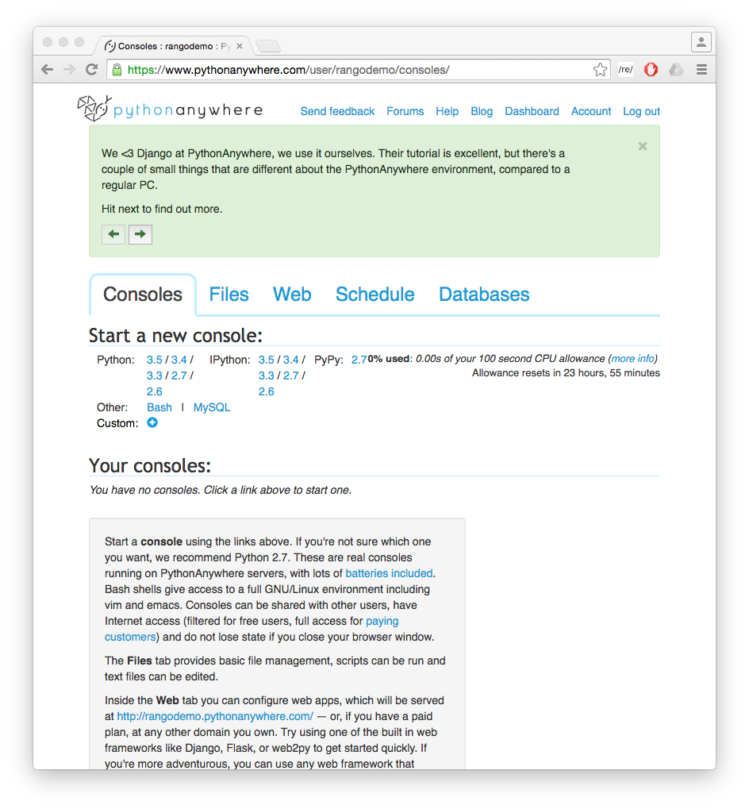
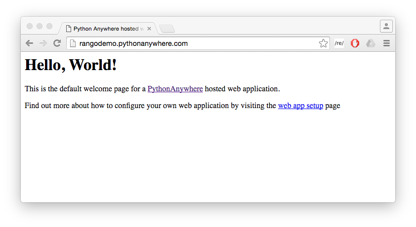

# Deploying Your Project {#chapter-deploy}
This chapter provides a step-by-step guide on how to deploy your Django applications. We'll be looking at deploying applications on [PythonAnywhere](https://www.pythonanywhere.com/?affiliate_id=000116e3), an online IDE and web hosting service. The service provides in-browser access to the server-based Python and Bash command line interfaces, meaning you can interact with PythonAnywhere's servers just like you would with a regular terminal instance on your own computer. Currently, PythonAnywhere are offering a free account which sets you up with an adequate amount of storage space and CPU time to get a Django application up and running.

I> ### Go Git It!
I>
I> You can do this chapter independently, assuming you have some working knowledge of Git. If you don't, refer to the [chapter on using Git](#chapter-git)).

## Creating a PythonAnywhere Account
First, [sign up for a Beginner PythonAnywhere account](https://www.pythonanywhere.com/?affiliate_id=000116e3). If your application takes off and becomes popular, you can always upgrade your account at a later stage to gain more storage space and CPU time along with a number of other benefits - such as hosting specific domains and SSH abilities, for example.

Once your account has been created, you will have your own little slice of the World Wide Web at `http://<username>.pythonanywhere.com`, where `<username>` is your PythonAnywhere username. It is from this URL that your hosted application will be available.

## The PythonAnywhere Web Interface
The PythonAnywhere web interface contains a *dashboard* which in turn provides a series of tabs allowing you to manage your application. The tabs as [illustrated in the figure below](#pa-interface) include:

- a *consoles* tab, allowing you to create and interact with Python and Bash console instances;
- a *files* tab, which allows you to upload to and organise files within your disk quota;
- a *web* tab, allowing you to configure settings for your hosted web application;
- a *schedule* tab, allowing you to setup tasks to be executed at particular times; and
- a *databases* tab, which allows you to configure a MySQL instance for your applications should you require it.

Of the the five tabs provided, we'll be working primarily with the *consoles* and *web* tabs. The [PythonAnywhere wiki](https://www.pythonanywhere.com/wiki/) provides a series of detailed explanations on how to use the other tabs.

{#pa-interface}

## Creating a Virtual Environment
As part of a its standard default Bash environment, PythonAnywhere comes with Python 2.7.6 and a number of pre-installed Python Packages (including *Django 1.3.7* and *Django-Registration 0.8*). Since we are using a different setup, we need to select a particular Python version and setup a virtual environment for our application.

First, open a Bash console from the PythonAnywhere *Consoles* tab by clicking the *Bash* link. When the terminal is ready for you to use, enter the following commands.

{lang="bash",linenos=off}    
	$ mkvirtualenv --python=<python-version> rango

If you've coded up the tutorial using Python 3.x, then change `<python-version>` to either `python3.4` or `python3.5`. If your are using Python 2.7.x, then change `<python-version>` to `python2.7`. The command you enter creates a new virtual environment called `rango` using the version of Python that you specified. For example, below is the output for when we created a Python 2.7 virtual environment.

{lang="bash",linenos=off}
	13:38 ~ $ mkvirtualenv --python=python2.7 rango
	Running virtualenv with interpreter /usr/bin/python2.7
	New python executable in /home/rangodemo/.virtualenvs/rango/bin/python2.7
	Also creating executable in /home/rangodemo/.virtualenvs/rango/bin/python
	Installing setuptools, pip, wheel...done.
	virtualenvwrapper creating /home/rangodemo/.virtualenvs/.../predeactivate
	virtualenvwrapper creating /home/rangodemo/.virtualenvs/.../postdeactivate
	virtualenvwrapper creating /home/rangodemo/.virtualenvs/.../preactivate
	virtualenvwrapper creating /home/rangodemo/.virtualenvs/.../postactivate
	virtualenvwrapper creating /home/rangodemo/.virtualenvs/.../get_env_details

Note in the example above, the PythonAnywhere username used is `rangodemo` - this will be replaced with your own username. The process of creating the virtual environment will take a little while to complete, after which you will be presented with a slightly different prompt.

{lang="text",linenos=off}
	(rango)13:40 ~ $

Note the inclusion of `(rango)` compared to the previous command prompt. This signifies that the `rango` virtual environment has been activated, so any package installations will be done within that virtual environment, leaving the wider system setup alone. If you issue the command `ls -la`, you will see that a directory called `.virtualenvs` has been created. This is the directory in which all of your virtual environments and associated packages will be stored. To confirm the setup, issue the command `which pip`. This will print the location in which the active `pip` binary is located - hopefully within `.virtualenvs` and `rango`, as shown in the example below.

{lang="text",linenos=off}    
	/home/<username>/.virtualenvs/test/bin/pip

To see what packages are already installed, enter `pip list`. Now we can customise the virtual environment by installing the required packages for our Rango application. Install all the required packages, by issuing the following commands.

{lang="text",linenos=off}    
	$ pip install -U django==1.9.5
	$ pip install pillow
	$ pip install django-registration-redux
	$ pip install django-bootstrap-toolkit

Alternatively, you could use `pip freeze > requirements.txt` to save your current development environment, and then on PythonAnywhere, run `pip install -r requirements.txt` to install all the packages in one go.

I> ### Waiting for the Bits to Download
I>
I> Installing all theses packages may take some time, so you can relax, call a friend, or tweet about our tutorial `@tangowithdjango`!

Once installed, check if Django has been installed with the command `which django-admin.py`. You should receive output similar to the following example.

{lang="text",linenos=off}    
	/home/<username>/.virtualenvs/rango/bin/django-admin.py

I> ###Virtual Environments on PythonAnywhere
I>
I> PythonAnywhere also provides instructions on how to setup virtual environments. [Check out their Wiki documentation for more information](https://help.pythonanywhere.com/pages/VirtualEnvForNewerDjango).

### Virtual Environment Switching
Moving between virtual environments can be done pretty easily. For this to work, you need to make sure that `virtualenvwrapper.sh` has been loaded by running `source virtualenvwrapper.sh`.

Rather than doing this each time you open up a console, you can add it to your `.bashrc` profile which is located in your home directory. Doing so will ensure the command is executed automatically for you every time you start a new Bash console instance. Any Bash consoles active will need to be closed for the changes to take effect.

With this done, you can then launch into a pre-existing virtual environment with the `workon` command. To load up the `rango` environment, enter:

{lang="text",linenos=off}    
	16:48 ~ $ workon rango

where `rango` can be replaced with the name of the virtual environment you wish to use. Your prompt should then change to indicate you are working within a virtual environment.

{lang="text",linenos=off}    
	(rango) 16:49 ~ $

You can then leave the virtual environment using the `deactivate` command. Your prompt should then be missing the `(rango)` prefix, with an example shown below.

{lang="text",linenos=off}    
	(rango) 16:49 ~ $ deactivate 
	16:51 ~ $

### Cloning your Git Repository
Now that your virtual environment for Rango is all setup, you can now clone your Git repository to obtain a copy of your project's files. Clone your repository by issuing the following command from your home directory:

{lang="text",linenos=off}    
	$ git clone https://<USERNAME>:<PASSWORD>@github.com/<OWNER>/<REPO_NAME>.git

where you replace - `<USERNAME>` with your GitHub username; - `<PASSWORD>` with your GitHub password; - `<OWNER>` with the username of the person who owns the repository; and - `<REPO_NAME>` with the name of your project's repository.

If you haven't put your code in a Git repository, you can clone the version we have made, by issuing the following command:

{lang="text",linenos=off}    
	16:54 ~ $ git clone https://github.com/leifos/tango_with_django_19.git

### Setting Up the Database
With your files cloned, you must then prepare your database. We'll be using the `populate_rango.py` module that we created earlier in the book. As we'll be running the module, you must ensure that you are using the `rango` virtual environment (i.e. you see `(rango)` as part of your prompt - if not, invoke `workon rango`). From your home directory, move into the `tango_with_django_19` directory, then to the `code` directory. Finally, `cd` into the `tango_with_django_project` directory - the directory with `manage.py` in it. Now issue the following commands.

{lang="text",linenos=off}    
	(rango) 16:55 ~/tango_with_django $ python manage.py makemigrations rango
	(rango) 16:55 ~/tango_with_django $ python manage.py migrate
	(rango) 16:56 ~/tango_with_django $ python populate_rango.py
	(rango) 16:57 ~/tango_with_django $ python manage.py createsuperuser

As discussed earlier in the book, the first command creates the migrations for the `rango` app, then the `migrate` command creates the *SQLlite3* database. Once the database is created, the database can be populated and a superuser created.

## Setting up Your Web Application
Now that the database is setup, we need to configure the PythonAnywhere [*NGINX*](https://www.nginx.com/resources/wiki/) Web server to serve up your application. Within PythonAnywhere's Web interface, navigate to your *dashboard* and click on the *Web* tab. On the left of the page that appears, click *Add a new web app.*

A popup box will then appear. Follow the instructions on-screen, and when the time comes, select the *manual configuration* option and complete the wizard. Make sure you select the same Python version as the one you selected earlier.

In a new tab or window in your web browser, go visit the domain `http://<username>.pythonanywhere.com`. You should be presented with the [default `Hello, World!` webpage, as shown below](#hello-world). This is because the WSGI script is currently serving up this page, and not your Django application. This is what we need to change next.

{#hello-world}

### Configure the Virtual Environment
To set the virtual environment for your app, navigate to the *Web* tab in PythonAnywhere's dashboard. From there, scroll all the way down under you see the heading *Virtualenv*. 

Enter in the path to your virtual environment. Assuming you created a virtual environment called `rango` the path would be:

{lang="text",linenos=off} 
	/home/<username>/.virtualenvs/rango

You can start a console to check if it is successful. 

Now in the *Code* section, you can set the path to your web applications source code.

{lang="text",linenos=off} 
	/home/<username>/<path-to>/tango_with_django_project/
		
If you have checked out code from our GitHub account, then the path will be something like:

{lang="text",linenos=off} 
	/home/<username>/tango_with_django_19/code/tango_with_django_project/

### Configuring the WSGI Script
The [Web Server Gateway Interface](http://en.wikipedia.org/wiki/Web_Server_Gateway_Interface), a.k.a. *WSGI* provides a simple and universal interface between Web servers and Web applications. PythonAnywhere uses WSGI to bridge the server-application link and map incoming requests to your subdomain to your web application.

To configure the WSGI script, navigate to the *Web* tab in PythonAnywhere's dashboard. From there, click the Web tab. Under the Code heading you can see a link to the WSGI configuration file in the Code section: e.g. `/var/www/<username>_pythonanywhere_com_wsgi.py`

The good people at PythonAnywhere have set up a sample WSGI file for us with several possible configurations. For your Web application, you'll need to configure the Django section of the file. The example below demonstrates a possible configuration for you application.

{lang="python",linenos=off}    
	import os
	import sys
	
	# ADD YOUR PROJECT TO THE PYTHONPATH FOR THE PYTHON INSTANCE
	path = '/home/<username>/<path-to>/tango_with_django_project/'
	if path not in sys.path:
		sys.path.append(path)
	
	# IMPORTANTLY GO TO THE PROJECT DIR
	os.chdir(path)
	
	# TELL DJANGO WHERE YOUR SETTINGS MODULE IS LOCATED
	os.environ.setdefault('DJANGO_SETTINGS_MODULE', 'tango_with_django_project.settings')
	
	# IMPORT THE DJANGO SETUP
	import django
	django.setup()
	
	# IMPORT THE DJANGO WSGI HANDLER TO TAKE CARE OF REQUESTS
	import django.core.handlers.wsgi
	application = django.core.handlers.wsgi.WSGIHandler()

Ensure that you replace `<username>` with your PythonAnywhere username, and update any other path settings to suit your application. You should also remove all other code from the WSGI configuration script to ensure no conflicts take place.

The script adds your project's directory to the `PYTHONPATH` for the Python instance that runs your web application. This allows Python to access your project's modules. If you have additional paths to add, you can easily insert them here. You can then specify the location of your project's `settings.py` module. The final step is to include the Django WSGI handler and invoke it for your application.

When you have completed the WSGI configuration, click the *Save* button at the top-right of the webpage. Navigate back to the *Web* tab within the PythonAnywhere dashboard, and click the *Reload* button at the top of the page. When the application is reloaded, visit `http://<username>.pythonanywhere.com`. Hopefully, it all went well, you should see your application up and running. If not, check through your scripts and paths carefully. Double check your paths by actually visiting the directories, and use `pwd` to confirm the path. 
	
I> ### Bad Gateway Errors??
I>
I> During testing, we noted that you can sometimes receive `HTTP 502 - Bad Gateway` errors instead of your application. Try reloading your application again, and then waiting a longer. If the problem persists, try reloading again. If the problem still persists, [check out your log files](#section-deploy-logfiles) to see if any accesses/errors are occurring, before contacting the PythonAnywhere support.

### Assigning Static Paths

We're almost there. One issue which we still have to address is to sort out paths for our application. Doing so will allow PythonAnywhere's servers to serve your static content, for example From the PythonAnywhere dashboard, click the *Web* tab and choose the subdomain hosting your application from the list on the left.

Underneath the *Static files* header, perform the following. 

Click the `Enter path` text. Set this to:   

{lang="python",linenos=off}  
	/home/<username>/.virtualenvs/rango/lib/<python-version>/site-packages/django/contrib/admin/static/admin
	
where `<username>` should be replaced with your PythonAnywhere username. `<python-version>` should also be replaced with `2.7`, `3.4`, etc., depending on which Python version you selected. You may also need to change `rango` if this is not the name of your application's virtual environment. Remember to hit return to confirm the path. Then click `Enter URL` and enter `/static/admin`, followed by hitting return.

Repeat the two steps above for the URL `/static/` and path `/home/<username>/<path-to>/tango_with_django_project/static`, with the path setting pointing to the `static` directory of your Web application.

With these changes saved, reload your web application by clicking the *Reload* button at the top of the page. Don't forget about potential
`HTTP 502 - Bad Gateway` errors, as discussed previously. Setting the static folders means that when you visit the `admin` interface, it has the predefined Django style sheets, and that you can access images and scripts. Reload your Web application, and you should now notice that your images are present.

### Bing API Key
[Add your Bing API key]({#section-bing-adding-key}) to `bing.key` to enable the search functionality in Rango.

### Turning off `DEBUG` Mode

When you application is ready to go, it's a good idea to instruct Django that your application is now hosted on a production server. To do this, open your project's `settings.py` file and change `DEBUG = True` to `DEBUG = False`. This disables [Django's debug mode](https://docs.djangoproject.com/en/1.9/ref/settings/#debug), and removes explicit error messages.

Changing the value of `DEBUG` also means you should set the `ALLOWED_HOSTS` property. Failing to perform this step will make Django return `HTTP 400 Bad Request` errors. Alter `ALLOWED_HOSTS` so that it includes your PythonAnywhere subdomain like in the example below.

{lang="python",linenos=off}    
	ALLOWED_HOSTS = ['<username>.pythonanywhere.com']

Again, ensure `<username>` is changed to your PythonAnywhere username. Once complete, save the file and reload the application via the PythonAnywhere Web interface.

## Log Files {#section-deploy-logfiles}

Deploying your web application to an online environment introduces another layer of complexity. It is likely that you will encounter new and bizarre errors due to unsuspecting problems. When facing such errors, vital clues may be found in one of the three log files that the Web server on PythonAnywhere creates.

Log files can be viewed via the PythonAnywhere web interface by clicking on the *Web* tab, or by viewing the files in `/var/log/` within a Bash console instance. The files provided are:

- `access.log`, which provides a log of requests made to your subdomain;
- `error.log`, which logs any error messages produced by your web application; and
- `server.log`, providing log details for the UNIX processes running your application.

Note that the names for each log file are prepended with your subdomain. For example, `access.log` will have the name `<username>.pythonanywhere.com.access.log`.

When debugging, you may find it useful to delete or move the log files so that you don't have to scroll through a huge list of previous attempts. If the files are moved or deleted, they will be recreated automatically when a new request or error arises.

X> ###Exercises
X>
X> Congratulations, you've successfully deployed Rango!
X> 
X> -  Tweet a link of your application to [@tangowithdjango](https://twitter.com/tangowithdjango).
X> -  E-mail us to let us know, and let us know your thoughts on the book.