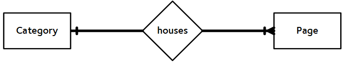

# Models and Databases {#chapter-models-databases}
When you think of databases, you will usually think of the *Structured Query Language (SQL)*, the common means with which we query the database for the data we require. You may be relieved to know that with Django, querying an underlying database - which can store all sorts of data, such as your website's user details - is taken care of by the [*object relational mapper (ORM)*](https://en.wikipedia.org/wiki/Object-relational_mapping). In essence, data stored within a database table can be encapsulated within a *model*. A model is a Python object that describes your database table's data. Instead of directly working on the database via SQL, you only need to manipulate the corresponding Python model object.

This chapter walks you through the basics of data management with Django and its ORM. You'll find it's incredibly easy to add, modify and delete data within your app's underlying database, and how straightforward it is to get data from the database to the Web browsers of your users.

## Rango's Requirements {#section-models-databases-requirements}
Before we get started, let's go over the data requirements for the Rango app that we are developing. Full requirements for the application are [provided in detail earlier on](#overview-er), but to refresh your memory, let's quickly summarise our client's requirements.

* Rango is a essentially a *web page directory* - a site containing links to other websites.
* There are a number of different *webpage categories* with each category housing a number of links. [We assumed in the overview chapter](#overview-er) that this is a one-to-many relationship. Check out the [Entity Relationship diagram below](#fig-rango-erd-repeat).
* A category has a name, a number of visits, and a number of likes.
* A page refers to a category, has a title, URL and a number of views.

{id="fig-rango-erd-repeat"}

## Telling Django about your Database {#section-models-database-telling}
Before we can create any models, we need to set up our database with Django. In Django 1.9, a `DATABASES` variable is automatically created in your `settings.py` module when you set up a new project. It'll look similar to the following example.

{lang="python",linenos=on}
    DATABASES = {
        'default': {
            'ENGINE': 'django.db.backends.sqlite3',
            'NAME': os.path.join(BASE_DIR, 'db.sqlite3'),
        }
    }

We can pretty much leave this as is for our Rango app. You can see a `default` database that is powered by a lightweight database engine, [SQLite](https://www.sqlite.org/) (see the `ENGINE` option). The `NAME` entry for this database is then the path to the database file, which is by default `db.sqlite3` in the root of your Django project.

I> ### Using other Database Engines
I> The Django database framework has been created to cater for a variety of different database backends, such as [PostgresSQL](http://www.postgresql.org/), [MySQL](https://www.mysql.com/) and [Microsoft's SQL Server](https://en.wikipedia.org/wiki/Microsoft_SQL_Server). For other database engines, other keys like `USER`, `PASSWORD`, `HOST` and `PORT` exist for you to configure the database with Django.
I>
I> While we don't cover how to use other database engines in this book, there are guides online which show you how to do this. A good starting point is the [official Django documentation](https://docs.djangoproject.com/en/1.9/ref/databases/#storage-engines).
I>
I> Note that SQLite is sufficient for demonstrating the functionality of the Django ORM. When you find your app has become viral and has accumulated thousands of users, you may want to consider [switching the database backend to something more robust](http://www.sqlite.org/whentouse.html).

## Creating Models
With your database configured in `settings.py`, let's create the two initial data models for the Rango application. Models for a Django app are stored in the respective `models.py` module. This means that for Rango, models are stored within `rango/models.py`.

For the models themselves, we will create two classes - one class representing each model. Both must [inherit](https://en.wikipedia.org/wiki/Inheritance_(object-oriented_programming)) from the `Model` base class, `django.db.models.Model`. The two Python classes will be the definitions for models representing *categories* and *pages*. Define the `Category` and `Page` model as follows.

{lang="python",linenos=on}
    class Category(models.Model):
        name = models.CharField(max_length=128, unique=True)
        
        def __str__(self):  # For Python 2, use __unicode__ too
            return self.name
    
    class Page(models.Model):
        category = models.ForeignKey(Category)
        title = models.CharField(max_length=128)
        url = models.URLField()
        views = models.IntegerField(default=0)
        
        def __str__(self):  # For Python 2, use __unicode__ too
            return self.title

T> ### Check `import` Statements
T> At the top of the `models.py` module, you should see `from django.db import models`. If you don't see it, add it in.

I> ### `__str__()` or `__unicode__()`?
I> The `__str__()` and `__unicode__()` methods in Python are essentially the `toString()` method of a Python class, if you're familiar with other object-orientated programming languages such as Java. Which method you should use depends on the version of Python you are using. Strings in version 2.x are represented in ASCII format, which therefore necessitates the use of the `__unicode__()` if you need [Unicode support](https://docs.python.org/2/howto/unicode.html). Strings in Python 3.x are Unicode by default, which removes the need for a separate `__unicode__()` method.
I>
I> In short, if you are using Python 2.x, include both a `__str__()` and `__unicode__()` method, with `__unicode__()` returning a Unicode representation of the string. If you are using Python 3.x, just use `__str__()` - the string is Unicode by default.

When you define a model, you need to specify the list of fields and their associated types, along with any required or optional parameters. Django provides a [comprehensive series of built-in field types](https://docs.djangoproject.com/es/1.9/ref/models/fields/#model-field-types). Some of the most commonly used are detailed below.

* `CharField`, a field for storing character data (e.g. strings). Specify `max_length` to provide a maximum number o characters the field can store.
* `URLField`, much like a `CharField`, but designed for storing resource URLs. You may also specify a `max_length` parameter.
* `IntegerField`, which stores integers.
* `DateField`, which stores a Python `datetime.date` object.

I> ### Other Field Types
I> Check out the [Django documentation on model fields](https://docs.djangoproject.com/es/1.9/ref/models/fields/#model-field-types) for a full listing of the Django field types you can use, along with details on the required and optional parameters that each has.

For each field, you can specify the `unique` attribute. If set to `True`, only one instance of a particular value in that field may exist throughout the entire database model. For example, take a look at our `Category` model defined above. The field `name` has been set to unique - thus every category name must be unique.

This is useful if you wish to use a particular field as an additional database key. You can also specify additional attributes for each field such as specifying a default value (`default='value'`), and whether the value for a field can be blank (or [`NULL`](https://en.wikipedia.org/wiki/Nullable_type)) (`null=True`) or not (`null=False`).

Django also provides simple mechanisms that allows you to relate models/database tables together in some way. These mechanisms are contained in three further field types, and are listed below.

* `ForeignKey`, a field type that allows us to create a [one-to-many relationship](https://en.wikipedia.org/wiki/One-to-many_(data_model)).
* `OneToOneField`, a field type that allows us to define a strict [one-to-one relationship](https://en.wikipedia.org/wiki/One-to-one_(data_model)).
* `ManyToManyField`, a field type which allows us to define a [many-to-many relationship](https://en.wikipedia.org/wiki/Many-to-many_(data_model)).

From our model examples above, the field `category` in model `Page` is of type `ForeignKey`. This allows us to create a one-to-many relationship with model/table `Category`, which is specified as an argument to the field's constructor. *You should be aware that Django creates an ID field for you automatically in each table relating to a model. You therefore do not need to explicitly define a primary key for each model - it's done for you!*

I> ### Using `__unicode__()` or `__str__()`
I> Why is defining these methods important? Doing so will make your life easier when you begin to use the Django admin interface later on in this chapter.
I>
I> Including a `__unicode__()` and/or `__str__()` method in your classes is also useful when debugging your code. Issuing a `print` on a `Category` model instance *without* a `__unicode__()` or `__str__()` method will return `<Category: Category object>`. We know it's a category, but *which one?* Including `__unicode__()` or `__str__()` would then return `<Category: python>`, where `python` is the `name` of a given category.

## Creating and Migrating the Database
With our models defined in `models.py`, we can now let Django work its magic and create the table representations in the underlying database. Django provides what is called a [*migration tool*](https://en.wikipedia.org/wiki/Data_migration) to help us set up and update the database to reflect any changes that may happen in representations of your models. For example, if you were to add a new field to a model, updating the database to reflect this change becomes straightforward.

### Setting up
First of all, the database must be *initialised*. This means creating it and all the associated tables within it so that data can then be stored within it. To do this, you must open a terminal or command prompt, and navigate to your project's root directory - where `manage.py` is stored. Run the following command.

{lang="text",linenos=off}
    $ python manage.py migrate
    
    Operations to perform:
      Apply all migrations: admin, contenttypes, auth, sessions
    Running migrations:
      Rendering model states... DONE
      Applying contenttypes.0001_initial... OK
      Applying auth.0001_initial... OK
      Applying admin.0001_initial... OK
      Applying admin.0002_logentry_remove_auto_add... OK
      Applying contenttypes.0002_remove_content_type_name... OK
      Applying auth.0002_alter_permission_name_max_length... OK
      Applying auth.0003_alter_user_email_max_length... OK
      Applying auth.0004_alter_user_username_opts... OK
      Applying auth.0005_alter_user_last_login_null... OK
      Applying auth.0006_require_contenttypes_0002... OK
      Applying auth.0007_alter_validators_add_error_messages... OK
      Applying sessions.0001_initial... OK

All apps that are installed in your Django project (check `INSTALLED_APPS` in `settings.py`) will update their database representations with this command. After this command is issued, you should then see a `db.sqlite3` file in your Django project's root.

Next, create a superuser to manage the database. Run the following command.

{lang="text",linenos=off}
    $ python manage.py createsuperuser

The superuser account will be used to access the Django admin interface, used later on in this chapter. Enter a username for the account, e-mail address and provide a password when prompted. Once completed, the script should finish successfully. Make sure you take a note of the username and password for your superuser account.

### Creating and Updating Models/Tables
Whenever you make changes to your app's models, you need to *register* the changes via the `makemigrations` command in `manage.py`. Specifying the `rango` app as our target, we then issue the following command from our Django project's root directory.

{lang="text",linenos=off}
    $ python manage.py makemigrations rango
    
    Migrations for 'rango':
      0001_initial.py:
        - Create model Category
        - Create model Page

Upon the completion of this command, check the `rango/migrations` directory to see that a Python script has been created. It's called `0001_initial.py`, which contains all the necessary details to create your database schema at that particular migration. 

I> ### Checking the Underlying SQL
I> If you want to check out the underlying SQL that the Django ORM issues to the database engine for a given migration, you can issue the following command.
I>
I> {lang="text",linenos=off}
I>     $ python manage.py sqlmigrate rango 0001
I>
I> In this example, `rango` is the name of your app, and `0001` is the migration you wish to view the SQL code for. Doing this allows you to get a better understanding of what exactly is going on at the database layer, such as what tables are created. You may find for complex database schemas including a many-to-many relationship that additional tables are created for you.

After you have created migrations for your app, you need to commit them to the database. Do so by once again issuing the `migrate` command.

{lang="text",linenos=off}
    $ python manage.py migrate
    
    Operations to perform:
      Apply all migrations: admin, rango, contenttypes, auth, sessions
    Running migrations:
      Rendering model states... DONE
      Applying rango.0001_initial... OK

This output confirms that the database tables have been created in your database, and you are good to go.

However, you may have noticed that our `Category` moel is currently lacking some fields that [were specified in Rango's requirements](#section-models-databases-requirements). **You'll be adding these in later to remind you of the migration process.**

## Django Models and the Shell
Before we turn our attention to demonstrating the Django admin interface, it's worth noting that you can interact with Django models directly from the Django shell - a very useful tool for debugging purposes. We'll demonstrate how to create a ``Category`` instance using this method.

To access the shell, we need to call ``manage.py`` from within your Django project's root directory once more. Run the following command.

``$ python manage.py shell``

This will start an instance of the Python interpreter and load in your project's settings for you. You can then interact with the models, with the following terminal session demonstrating this functionality. Check out the inline commentary that we added to see what each command achieves.

{lang="python",linenos=off}
	# Import the Category model from the Rango application
	>>> from rango.models import Category
	
	# Show all the current categories
	>>> print(Category.objects.all())
	[] # Returns an empty list (no categories have been defined!)
	
	# Create a new category object, and save it to the database.
	>>> c = Category(name="Test")
	>>> c.save()
	
	# Now list all the category objects stored once more.
	>>> print(Category.objects.all())
	[<Category: test>] # We now have a category called 'test' saved in the database!
	
	# Quit the Django shell.
	>>> quit()

In the example, we first import the model that we want to manipulate. We then print out all the existing categories. As our underlying `Category` table is empty, an empty list is returned. Then we create and save a `Category`, before printing out all the categories again. This second `print` then shows the new ``Category`` just added. Note the name, `Test` appears in the second `print` - this is your `__str__()` or `__unicode__()` method at work!

X> ### Complete the Official Tutorial
X> The example above is only a very basic taster on database related activities you can perform in the Django shell. If you have not done so already, it's now a good time to complete part one of the [official Django Tutorial to learn more about interacting with models](https://docs.djangoproject.com/en/1.9/intro/tutorial02/). Also check out the [official Django documentation on the list of available commands](https://docs.djangoproject.com/en/1.9/ref/django-admin/#available-commands) for working with models.

## Configuring the Admin Interface
One of the eye-catching features of Django is the built-in, Web-based administrative interface that allows you to browse and edit data represented as model instances (from the corresponding database tables).

Setting everything up is relatively straightforward. In your project's `settings.py` module, you will notice that one of the preinstalled apps (within the `INSTALLED_APPS` list) is `django.contrib.admin`. Furthermore, there is a `urlpattern` that matches `admin/` within your project's `urls.py` module.

By default, things are pretty much ready to go. Start the Django development server in the usual way with the following command.

{lang="text",linenos=off}
    $ python manage.py runserver

Navigate your Web browser to `http://127.0.0.1:8000/admin/`. You are then presented with a login prompt. Using the username and password you created previously with the `python manage.py createsuperuser` command, login. You are then presented with an interface looking [similar to the one shown below](#fig-ch5-admin-first).

{id="fig-ch5-admin-first"}

While this looks good, we are missing the `Category` and `Page` models that were defined for the Rango app. To include these models, we need to give Rango some help.

To do this, open the file `rango/admin.py`. With an `include` statement already present, modify the module so that you `register` each class you want to include. The example below registers both the `Category` and `Page` class to the admin interface.

{lang="python",linenos=on}
    from django.contrib import admin
    from rango.models import Category, Page
    
    admin.site.register(Category)
    admin.site.register(Page)

Adding further classes which may be created in the future is as simple as adding another call to the `admin.site.register()` method.

With these changes saved, restart the Django development server and revisit `http://127.0.0.1:8000/admin/`. You will now see the `Category` and `Page` models, [as shown below](#fig-ch5-admin-second).

{id="fig-ch5-admin-second"}

Try clicking the `Categorys` link within the `Rango` section. From here, you should see the `test` category that we created earlier via the Django shell.

X> ### Experiment with the Admin Interface
X> You'll be using the admin interface quite a bit to verify data is stored correctly as you develop the Rango app. Experiment with it, and see how it all works. The interface is self-explanatory and straightforward to understand.
X>
X> Delete the `test` category that was previously created. We'll be populating the database shortly with more example data.

I> ### User Management
I> The Django admin interface is your port of call for user management, through the Authentication and Authorisation section. Here, you can create, modify and delete user accounts, all with varying privilege levels.

T> ### Plural vs. Singular Spellings
T>  Note the typo within the admin interface (`Categorys`, not `Categories`). This typo can be fixed by adding a nested `Meta` class into your model definitions with the `verbose_name_plural` attribute. Check out a modified version of the `Category` model below for an example, and [Django's official documentation on models](https://docs.djangoproject.com/en/1.9/topics/db/models/#meta-options) for more information about what can be stored within the `Meta` class.
T>
T> {lang="python",linenos=on}
T>     class Category(models.Model):
T>         name = models.CharField(max_length=128, unique=True)
T>     
T>         class Meta:
T>             verbose_name_plural = 'categories'
T>     
T>         def __str__(self):
T>             return self.name

I> ### Expanding `admin.py`
I> It should be noted that the example ``admin.py`` module for your Rango application is the most simple, functional example available. There are many different features which you can use in the to perform all sorts of nice customisations, such as changing the way models are presented. You can refer to the [official Django documentation on the admin interface](https://docs.djangoproject.com/en/1.9/ref/contrib/admin/) for more information if you're interested.

## Creating a Population Script
Entering test data into your database tends to be a hassle. Many developers will add in some bogus test data by randomly hitting keys, just like `dghiewrojbfjro`. Rather than do this, it is better to write a script so that you and your collaborators works from the same tests data. Furthermore, this approach would guarantee that you have useful and pseudo realistic data rather than random junk. It's therefore good practice to create what we call a *population script* for your app. This script is designed to automatically populate your database with test data for you

To create a population script for Rango, start by creating a new Python module within your Django project's root directory (e.g. ``<workspace>/tango_with_django_project/``). Create the ``populate_rango.py`` file and add the following code.

{lang="python",linenos=on}
	import os
	os.environ.setdefault('DJANGO_SETTINGS_MODULE', 'tango_with_django_project.settings')

	import django
	django.setup()

	from rango.models import Category, Page
	
	def populate():
	    python_cat = add_cat('Python')
	
	    add_page(cat=python_cat,
	        title="Official Python Tutorial",
	        url="http://docs.python.org/2/tutorial/")
	
	    add_page(cat=python_cat,
	        title="How to Think like a Computer Scientist",
	        url="http://www.greenteapress.com/thinkpython/")
	
	    add_page(cat=python_cat,
	        title="Learn Python in 10 Minutes",
	        url="http://www.korokithakis.net/tutorials/python/")
	
	    django_cat = add_cat("Django")
	
	    add_page(cat=django_cat,
	        title="Official Django Tutorial",
	        url="https://docs.djangoproject.com/en/1.5/intro/tutorial01/")
	
	    add_page(cat=django_cat,
	        title="Django Rocks",
	        url="http://www.djangorocks.com/")
	    
	    add_page(cat=django_cat,
	        title="How to Tango with Django",
	        url="http://www.tangowithdjango.com/")
	
	    frame_cat = add_cat("Other Frameworks")
	
	    add_page(cat=frame_cat,
	        title="Bottle",
	        url="http://bottlepy.org/docs/dev/")
	
	    add_page(cat=frame_cat,
	        title="Flask",
	        url="http://flask.pocoo.org")
	
	    # Print out what we have added to the user.
	    for c in Category.objects.all():
	        for p in Page.objects.filter(category=c):
	            print("- {0} - {1}".format(str(c), str(p)))
	
	def add_page(cat, title, url, views=0):
	    p = Page.objects.get_or_create(category=cat, title=title)[0]
	    p.url=url
	    p.views=views
	    p.save()
	    return p
	
	def add_cat(name):
	    c = Category.objects.get_or_create(name=name)[0]
	    return c
	
	# Start execution here!
	if __name__ == '__main__':
	    print("Starting Rango population script...")
	    populate()

T> ### Understand this Code!
T> Don't copy, paste and leave. Add the code to your new module, but read the explanations below as to what is going on. You'll learn something new!

While this looks like a lot of code, what is going on is essentially a series of function calls to two small functions, `add_page()` and `add_cat()` defined towards the end of the module. Reading through the code, we find that execution starts at the *bottom* of the module - look for line 65. This is because above this point, we define functions - these are not executed unless we call them. When the interpreter hits [`if __name__ == '__main__'`](http://stackoverflow.com/a/419185), we hit the `populate()` function.

E> ### Importing Models
E> When importing Django models, make sure you have imported your project's settings by importing `django` and setting the environment variable `DJANGO_SETTINGS_MODULE` to be your project's setting file, as demonstrated in lines 1 to 6 above. You then call ``django.setup()`` to import your Django project's settings.
E>
E> If you don't do this crucial step, **an exception will be raised when you attempt to import your models as the necessary infrastructure has not yet been initialised**. This is why we import `Category` and `Page` *after* the settings have been loaded on line 8.

The `populate()` function is responsible for the calling the `add_cat()` and `add_page()` functions repeatedly. These functions are in turn responsible for the creation of new categories and pages. `populate()` keeps tabs on categories that are created. As an example, a reference to the `Python` category is stored in local variable `python_cat` - check line 11 above. This is done as a `Page` requires a `Category` reference. After `add_cat()` and `add_page()` are called in `populate()`, the function concludes by looping through all new `Category` and associated `Page` objects, displaying their names on the terminal.

I> ### Creating Model Instances
I> We make use of the convenience `get_or_create()` method for creating model instances in the population script above. As we don't want to create duplicates of the same entry, we can use `get_or_create()` to check if the entry exists in the database for us. If it doesn't exist, the method creates it. It it does, then a reference to the specific model instance is returned.
I> 
I> This helper method can remove a lot of repetitive code for us. Rather than doing this laborious check ourselves, we can make use of code that does exactly this for us. *Why reinvent the wheel if it’s already there?*
I>
I> The `get_or_create()` method returns a tuple of `(object, created)`. The first element `object` is a reference to the model instance that the `get_or_create()` method creates if the database entry was not found. The entry is created using the parameters you pass to the method - just like `category`, `title`, `url` and `views` in the example above. If the entry already exists in the database, the method simply returns the model instance corresponding to the entry. `created` is a boolean value; `True` is returned if `get_or_create()` had to create a model instance.
I>
I> This explanation therefore means that the `[0]` at the end of our call to the `get_or_create()` returns the object reference only. Like most other programming language data structures, Python tuples use [zero-based numbering](http://en.wikipedia.org/wiki/Zero-based_numbering).
I> 
I> You can check out the [official Django documentation](https://docs.djangoproject.com/en/1.9/ref/models/querysets/#get-or-create) for more information on the handy `get_or_create()` method.

When saved, you can then run your new populations script by changing the present working directory in a terminal to the Django project's root. It's then a simple case of executing the command ``$ python populate_rango.py``. You should then see output similar to that shown below.

{lang="text",linenos=off}
	$ python populate_rango.py
	
	Starting Rango population script...
	- Python - Official Python Tutorial
	- Python - How to Think like a Computer Scientist
	- Python - Learn Python in 10 Minutes
	- Django - Official Django Tutorial
	- Django - Django Rocks
	- Django - How to Tango with Django
	- Other Frameworks - Bottle
	- Other Frameworks - Flask

Next, verify that the population script actually populated the database. Restart the Django development server, navigate to the admin interface (at `http://127.0.0.1:8000/admin/`) and check that you have some new categories and pages. Do you see all the pages if you click `Pages`, like in the figure shown below?

{id="fig-admin-populated"}

While creating a population script may take time, you will save yourself time in the long run. When deploying your app elsewhere, running the population script after setting everything up means you can start demonstrating your app straight away. You'll also find it very handy when it comes to [unit testing your code](#chapter-testing).

## Basic Workflow
Now that we've covered the core principles of dealing with Django's ORM, now is a good time to summarise the processes involved in setting everything up. We've split the core tasks into separate sections for you. Check this section out when you need to quickly refresh your mind of the different steps.

### Setting up your Database
With a new Django project, you should first [tell Django about the database you intend to use](##section-models-database-telling) (i.e. configure `DATABASES` in `settings.py`). You can also register any models in the `admin.py` module of your app to make them accessible via the admin interface.

### Adding a Model
The workflow for adding models can be broken down into five steps.

1. First, create your new model(s) in your Django application's `models.py` file.
2. Update `admin.py` to include and register your new model(s).
3. Perform the migration `$ python manage.py makemigrations`.
4. Apply the changes `$ python manage.py migrate`. This will create the necessary infrastructure within the database for your new model(s).
5. Create/edit your population script for your new model(s).

Invariably, there will be times when you will have to delete your database. When this happens, run the following commands from the `manage.py` module.

1. `migrate` your database - this will set everything up in the new database. Ensure that your app is listed in the migrations that are committed. If it is not, run the `makemigrations <appname>` command, where `<appname>` is the name of your app.
2. Create a new administrative account with the `createsuperuser` command.

X> ### Exercises
X> Now that you've completed this chapter, try out these exercises to reinforce and practice what you have learnt. **Note that following chapters will have expected you to have completed these exercises!
X>
X> * Update the `Category` model to include the additional attributes `views` and `likes` where the `default` values for each are both zero (`0`).
X> * Make the migrations for your app, then migrate your database to commit the changes.
X> * Update your population script so that the `Python` category has `128` views and `64` likes, the `Django` category has `64` views and `32` likes, and the `Other Frameworks` category has `32` views and `16` likes.
X> * Delete and recreate your database, populating it with your updated population script.
X> * Undertake the [second part of the official Django tutorial](https://docs.djangoproject.com/en/1.9/intro/tutorial02/) if you have not already done so. This will help to reinforce further what you have learnt here, and to learn more about customising the admin interface.
X> * Customise the admin interface. Change it in such a way so that when you view the `Page` model, the table displays the `category`, the `name` of the page and the `url` - just [like in the screenshot shown below](#fig-admin-completed).

T> ### Exercise Hints
T> If you require some help or inspiration to get these exercises done, these hints will hopefully help you out.
T> 
T> * Modify the `Category` model by adding in the fields, `view` and `likes` as `IntegerFields`.
T> * Modify the `add_cat` function in the `populate.py` script, to take the `views` and `likes`. Once you get the `Category` `c`, then you can update the number of views with `c.views`, and similarly with `likes`. Don't forget to `save()` the instance!
T> * To customise the admin interface, you will need to edit `rango/admin.py` and create a `PageAdmin` class that inherits from `admin.ModelAdmin`. 
T> * Within your new `PageAdmin` class, add `list_display = ('title', 'category', 'url')`.
T> * Finally, register the `PageAdmin` class with Django's admin interface. You should modify the line `admin.site.register(Page)`. Change it to `admin.site.register(Page, PageAdmin)` in Rango's `admin.py` file.

{id="fig-admin-completed"}
