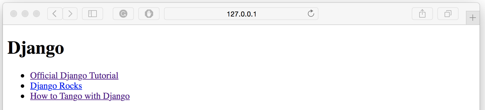

#Models, Templates and Views {#chapter-mtv}

Now that we have the models set up and populated the database with some sample data, we can
now start connecting the models with the views and templates. 

##Basic Workflow: Data Driven Pages

To do this there are five main steps that you must undertake to create a data
driven webpage in Django.

1.  First, import the models you wish to use into your application's
    `views.py` file.
2.  Within the view, query the model to get the data you want to present.
3.  Pass the results from your model into the template's context.
4.  Setup your template to present the data to the user in whatever way you wish.
5.  If you have not done so already, map a URL to your view.

These steps highlight how Django's framework separates the concerns
between models, views and templates.

##Showing Categories on Rango's Homepage
One of the requirements regarding the main page was to show the top
five rango'ed categories.

### Importing Required Models

To fulfil this requirement, we will go through each of the above steps.
First, open `rango/views.py` and import the `Category` model from
Rango's `models.py` file.

{lang="python",linenos=off}
	# Import the Category model
	from rango.models import Category

### Modifying the Index View

With the first step out of the way, we then want to modify our `index()`
function. If we cast our minds back, we should remember the `index()`
function is responsible for the main page view. Modify the function to
look like the example below.

{lang="python",linenos=off}
	def index(request):
    	# Query the database for a list of ALL categories currently stored.
    	# Order the categories by no. likes in descending order.
    	# Retrieve the top 5 only - or all if less than 5.
    	# Place the list in our context_dict dictionary
		# which will be passed to the template engine.
    	
		category_list = Category.objects.order_by('-likes')[:5]
    	context_dict = {'categories': category_list}

    	# Render the response and send it back!
    	return render(request, 'rango/index.html', context_dict)

Here we have performed steps two and three in one go. First, we queried
the `Category` model to retrieve the top five categories. Here we used
the `order_by()` method to sort by the number of likes in descending
order - hence the inclusion of the `-`. We then restricted this list to
the first 5 `Category` objects in the list.

With the query complete, we passed a reference to the list (stored as
variable `category_list`) to the dictionary, `context_dict`. This
dictionary is then passed as part of the context for the template engine
in the `render()` call.

W> ###Warning
W>
W> Note that the Category Model contains the field `likes`. So for this
W> to work you need to have completed the exercises in the previous
W> chapter, i.e. the Category Model needs to be updated to include the
W> `likes` field.

### Modifying the Index Template

With the view updated, all that is left for us to do is update the
template `rango/index.html`, located within your project's `templates`
directory. Change the HTML code of the file so that it looks like the
example shown below.

{lang="html",linenos=off}
	<!DOCTYPE html>
	<html>
    <head>
        <title>Rango</title>
    </head>

    <body>
        <h1>Rango says...</h1>
        
hey there partner!

		

        
            <ul>
                
                <li>{{ category.name }}</li>
                
            </ul>
        
            <strong>There are no categories present.</strong>
        	
		
	
		
	
        <a href="/rango/about/">About Rango</a> 
         
		

    </body>
	</html>

Here, we make use of Django's template language to present the data
using `if` and `for` control statements. Within the `<body>` of the
page, we test to see if `categories` - the name of the context variable
containing our list - actually contains any categories (i.e.
``).

If so, we proceed to construct an unordered HTML list (within the `<ul>`
tags). The for loop (``) then iterates
through the list of results, printing out each category's name
(`{{ category.name }})` within a pair of `<li>` tags to indicate a list
element.

If no categories exist, a message is displayed instead indicating so.

As the example shows in Django's template language, all commands are
enclosed within the tags ``, while variables are referenced
within `{{` and `}}` brackets.

If you now visit Rango's homepage at <http://127.0.0.1:8000/rango/>, you
should see a list of categories underneath the page title just
like in [Figure](#figch6-rango-categories-index).

{id="fig-ch6-rango-categories-index"}

##Creating a Details Page

According to Rango's specification, we also need to show a list of pages
that are associated with each category. We have a number of challenges
here to overcome. A new view must be created, which should be
parameterised. We also need to create URL patterns and URL strings that
encode category names.

### URL Design and Mapping

Let's start by considering the URL problem. One way we could handle this
problem is to use the unique ID for each category within the URL. For
example, we could create URLs like `/rango/category/1/` or
`/rango/category/2/`, where the numbers correspond to the categories
with unique IDs 1 and 2 respectively. However, these URLs are not easily
understood by humans. Although we could probably infer that the number
relates to a category, how would a user know what category relates to
unique IDs 1 or 2? The user wouldn't know without trying.

Instead, we could just use the category name as part of the URL.
`/rango/category/python/` should give us a list of pages related to the
Python category. This is a simple, readable and meaningful URL. If we go
with this approach, we'll have to handle categories which have multiple
words, like 'Other Frameworks', etc.

T> ### Clean your URLs
T>
T> Designing clean and readable URLs is an important aspect of web design.
T> See [Wikipedia's article on Clean
T> URLs](http://en.wikipedia.org/wiki/Clean_URL) for more details.

To handle this problem we are going to make use of the `slugify` function
provided by Django, based on the answers provided at:
<http://stackoverflow.com/questions/837828/how-do-i-create-a-slug-in-django>

### Update Category Table with Slug Field

To make readable URLs we are going to include a slug field in the
`Category` model. First we need to import the function `slugify` from
Django, which will replace whitespace with hyphens, i.e "how do i create
a slug in django" turns into "how-do-i-create-a-slug-in-django".

W> ###Unsafe URLs
W>
W> While you can use spaces in URLs, it is considered to be unsafe to use
W> them. Check out [IETF Memo on
W> URLs](http://www.ietf.org/rfc/rfc1738.txt) to read more.

Then we need to override the `save` method of the `Category` model,
which we will call the `slugify` method and update the `slug` field with
it. Note that every time the category name changes, the slug will also
change. Update your model, as shown below, and add in the import.

{lang="python",linenos=off}
	from django.template.defaultfilters import slugify
	
	class Category(models.Model):
	    name = models.CharField(max_length=128, unique=True)
	    views = models.IntegerField(default=0)
	    likes = models.IntegerField(default=0)
	    slug = models.SlugField()
    
	    def save(self, *args, **kwargs):
	        self.slug = slugify(self.name)
	        super(Category, self).save(*args, **kwargs)
    
	    class Meta:
	        verbose_name_plural = 'categories'
    
	    def __str__(self):
	        return '<Category: {0}>'.format(self.name)

Now that the model has been updated, we need to propagate these changes to the database.
However, since we already have data in the database we need to consider the implications of this change.
Basically, for all the existing category names, we want to turn them into slugs (which is performed when the record is saved). When we update the models via the migration tool, it will add the field, and provide the option of populating the field with a default value. Of course, we want a specific value in each field. In order to correctly populate the slug field we will need to first perform the migration and then re-run the population script - this is because in the population script we explicitly call the 'save' method for each entry. This will trigger the 'save' we have implemented and update the slug accordingly.

To perform the migration issue the following commands:

{lang="text",linenos=off}
	$ python manage.py makemigrations rango
	$ python manage.py migrate

Since we did not provide a default value for the slug, and we already
have existing data in the model, then the migrate command will give you
two options. Select the option to provide a default, and enter ''. 
Then re-run the population script, which will update the slug field:

{lang="text",linenos=off}
	$ python populate_rango.py

Now run the server (`python manage.py runserver`), and inspect the data in the models via the admin interface (`http://127.0.0.1:8000/admin/`).

If you go to add in a new category via the admin interface you may encounter a problem, or two! Lets say we added in the category, `Python User Groups`. If you do so, and try to save the record Django will not let you save it unless you also fill in the slug field too. While we could type in `python-user-groups` this is error prone, and it would be neater to have this done automatically. The next problem is if we create another category say `django` where the `d` is lowercase, and then we enter in the slug, `django`. Now if we go to identify the Django/django category we can not uniquely select the record. To solve the first problem, we can either update our model so that the slug field allows blank entries, i.e 

{lang="python",linenos=off}
	slug = models.SlugField(blank=True) 
	
or we can customize the admin interface so that it automatically pre-populates the slug field as you type in the category name.
To do this update `rango/admin.py` with the following code:

{lang="python",linenos=off}
	from django.contrib import admin
	from rango.models import Category, Page

	# Add in this class to customized the Admin Interface
	class CategoryAdmin(admin.ModelAdmin):
    	prepopulated_fields = {'slug':('name',)}

	# Update the registeration to include this customised interface
	admin.site.register(Category, CategoryAdmin)
	admin.site.register(Page)
	
Try out the admin interface and add in a new category. Pretty cool, hey!

Now that we have addressed the first problem, we can ensure that the slug field is also unique, by adding the contraint to the slug field i.e.

{lang="python",linenos=off}
	slug = models.SlugField(unique=True)

Now that we have added in the slug field we can now use the slugs to uniquely identify each category :-). We could of added the unique constraint earlier, but if we performed the migration and set everything to be an empty string be default it would have given raised an error. This is because the unique constraint would have been violated. We could of deleted the database and then recreated everything - but that is not always desirable. 

W> ###Migration Woes
W>
W> It is always best to plan out your database in advance and avoid changing them. 
W> Making a population script means that you easily recreate your database if you need to delete it.
W> Sometimes it is just better to just delete the database and recreate everything than try and work out where the conflict is coming from.
W> A neat exercise is to write a script to output the data in the database so that any changes you make can be saved out into a file that can be read in later.

### Category Page Workflow
Now to implement the category pages so that they can be accessed via `/rango/category/<category-name-slug>/` we need to make a number of changes and undertake the following steps:

1. Import the Page model into `rango/views.py`.
2. Create a new view in `rango/views.py` - called `category` - The `category` view will take an additional parameter, `category_name_url` which will stored the encoded category name.
	-   We will need helper functions to encode and decode the `category_name_url`.
3.  Create a new template, `templates/rango/category.html`.
4.  Update Rango's `urlpatterns` to map the new `category` view to a URL pattern in `rango/urls.py`.

We'll also need to update the `index()` view and `index.html` template
to provide links to the category page view.

### Category View

In `rango/views.py`, we first need to import the `Page` model. This
means we must add the following import statement at the top of the file.

{lang="python",linenos=off}
	from rango.models import Page

Next, we can add our new view, `category()`.

{lang="python",linenos=off}
	def category(request, category_name_slug):
    	# Create a context dictionary which we can pass 
		# to the template rendering engine.
    	context_dict = {}
		
    	try:
        	# Can we find a category name slug with the given name?
        	# If we can't, the .get() method raises a DoesNotExist exception.
        	# So the .get() method returns one model instance or raises an exception.
        	category = Category.objects.get(slug=category_name_slug)
        	context_dict['category_name'] = category.name

        	# Retrieve all of the associated pages.
        	# Note that filter returns a list of page objects or and empty list
        	pages = Page.objects.filter(category=category)

        	# Adds our results list to the template context under name pages.
        	context_dict['pages'] = pages
        	# We also add the category object from 
			# the database to the context dictionary.
        	# We'll use this in the template to verify that the category exists.
        	context_dict['category'] = category
    	except Category.DoesNotExist:
        	# We get here if we didn't find the specified category.
        	# Don't do anything - 
			# the template will display the "no category" message for us.
			context_dict['category'] = None
			context_dict['pages'] = None
			

    	# Go render the response and return it to the client.
    	return render(request, 'rango/category.html', context_dict)

Our new view follows the same basic steps as our `index()` view. We
first define a context dictionary, then we attempt to extract the data
from the models, and add in the relevant data to the context dictionary.
We determine which category by using the value passed as parameter
`category_name_slug` to the `category()` view function. If the category slug
is found in the `Category` model, we can then pull out the associated
pages, and add this to the context dictionary, `context_dict`.

### Category Template

Now let's create our template for the new view. In
`<workspace>/tango_with_django_project/templates/rango/` directory,
create `category.html`. In the new file, add the following code.

{lang="hml",linenos=off}
	<!DOCTYPE html>
	<html>
    <head>
        <title>Rango</title>
    </head>

    <body>
        <h1>{{ category_name }}</h1>
		

        
            
            <ul>
                
                <li><a href="{{ page.url }}">{{ page.title }}</a></li>
                
            </ul>
            
                <strong>No pages currently in category.</strong>
            
        
            The specified category {{ category_name }} does not exist!
        
		

    </body>
	</html>

The HTML code example again demonstrates how we utilise the data passed
to the template via its context through the tags `{{ }}`. We access the `category_name`
variable, `category` and `pages` objects. 

If the `category` exists, then we check to see if there are any pages in the category. If so, we iterate through the pages using the `` template tags.
For each page in the `pages` list, we present their `title` and `url` attributes. This is displayed in an unordered HTML list (denoted by the `<ul>` tags). If you are not too familiar with HTML then check out the [HTML Tutorial by W3Schools.com](http://www.w3schools.com/html/) to learn more about the different tags.

I> ###Note on Conditional Template Tags
I>
I> The Django template conditional tag - `` - is a really neat
I> way of determining the existence of an object within the template's
I> context. Try getting into the habit of performing these checks to
I> reduce the scope for potential exceptions that could be raised within
I> your code.
I>
I> Placing conditional checks in your templates - like
I> `` in the example above - also makes sense
I> semantically. The outcome of the conditional check directly affects
I> the way in which the rendered page is presented to the user - and
I> presentational aspects of your Django applications should be
I> encapsulated within templates.

### Parameterised URL Mapping

Now let's have a look at how we actually pass the value of the
`category_name_url` parameter to the `category()` function. To do so, we
need to modify Rango's `urls.py` file and update the `urlpatterns` tuple
as follows.

{lang="python",linenos=off}
	urlpatterns = patterns('',
    	url(r'^$', views.index, name='index'),
    	url(r'^about/$', views.about, name='about'),
    	url(r'^category/(?P<category_name_slug>[\\w\\-]+)/$', 
		views.category, name='category'),) 

As you can see, we have added in a rather complex entry that will invoke
`view.category()` when the URL pattern
`r'^category/(?P<category_name_slug>[\\w\\-]+)/$'` is matched. 

There are a two things to note here. First we have added a parameter name with in the URL pattern, i.e. `<category_name_slug>`, which we will be able to access in our view later on. So when you create a parameterised URL you need to ensure that the parameters that you include in the URL are declared in the corresponding view.
The next thing to note is that the regular expression `[\\w\\-]+)` will look for any sequence of alphanumeric characters e.g. a-z, A-Z, or 0-9 denoted by `\\w` and any hyphens (-) denoted by `\\-`, and we can match as many of these as we like denoted by the `[ ]+` expression.

So essentially the characters (both alphanumeric and
 hyphens) between `category/` and the trailing `/` at the end of a
 matching URL will be passed to method `views.category()` as named
 parameter `category_name_slug`. For example, the URL
 `category/python-books/` would result in the `category_name_slug` having the value,
 `python-books`.

 All view functions defined as part of a Django
 applications *must* take at least one parameter. This is typically called
 `request` - and provides access to information related to the given
 HTTP request made by the user. When parameterising URLs, you supply
 additional named parameters to the signature for the given view.  
  That is why our `category()` view was defined as follows: 

{lang="python",linenos=off}
	 def category(request, category_name_slug):
    

<!--
It's not the position of the additional parameters that matters, it's
the *name* that must match anything defined within the URL pattern.
 Note how `category_name_slug` defined in the URL pattern matches the
 `category_name_slug` parameter defined for our view. 
		Using  `category_name_slug` in our view will give `python-books`, or whatever value was supplied as that part of the URL.
-->
		
I> ###Regex Hell
I>
I> Some people, when confronted with a problem, think 
I> “I know, I'll use regular expressions.”   Now they have two problems.
I> [Jamie Zawinski](http://regex.info/blog/2006-09-15/247)
I>
I> Regular expressions may seem horrible and confusing at first, but
I> there are tons of resources online to help you. [This cheat
I> sheet](http://cheatography.com/davechild/cheat-sheets/regular-expressions/)
I> is an excellent resource for fixing regular expression problems.

### Modifying the Index Template

Our new view is set up and ready to go - but we need to do one more
thing. Our index page template needs to be updated so that it links to the category pages that are listed.
 We can update the `index.html` template to now include a link to the category page via the
slug.

{lang="html",linenos=off}
	<!DOCTYPE html>
	<html>
	<head>
		<title>Rango</title>
	</head>
    <body>
		<h1>Rango says...</h1>
		

			 hey there partner!
		 

		

        
        <ul>
			
            	<!-- Following line changed to add an HTML hyperlink -->
                <li><a href="/rango/category/{{ category.slug }}">{{ category.name }}</a></li>
                
		</ul>
		
			<strong>There are no categories present.</strong>
		
		

		
	
       		<a href="/rango/about/">About Rango</a> 
       	 	 
		

    </body>
	</html>

Again we used the HTML tag `<ul>` to define an unordered list and create a series of list elements (`<li>`) which contain a HTML hyperlink
(`<a>`). The hyperlink has an `href` attribute, which we use to specify
the target URL defined by `/rango/category/{{ category.slug }}`, i.e. `/rango/category/python-books/`.

### Demo

Let's try everything out now by visiting Rango's homepage. You
should see up to five categories on the index page. The categories
should now be links. Clicking on `Djano` should then take you
to the `Django` category page, as shown in the [Figure](#fig-ch6-rango-links). If you see a list of links like
`Official Django Tutorial`, then you've successfully set up the new
page. 

What happens when you visit a category that does not exist? Try navigating a category which doesn't exist, like
`/rango/category/computers/`. You should see a message telling you that
no pages exist in the category.

{id="fig-ch6-rango-links"}

X> ##Exercises
X>
X> 
X> Reinforce what you've learnt in this chapter by trying out the following exercises.
X> 
X> - Update the population script to add some value to the `views` count for each page.
X> -   Modify the index page to also include the top 5 most viewed pages.
X> - Include a heading for the "Most Liked Categories" and "Most Viewed Pages"
X> - Include a back to the index page from the category page.
X> -   Undertake the [part three of official Django
X>   tutorial](https://docs.djangoproject.com/en/1.9/intro/tutorial03/)
X>    if you have not done so already to reinforce what you've learnt here.

{id="fig-ch6-exercises"}

T> ### Hints
T>
T> - When updating the population script add in the values to the page dictionaries first then when iterating through the page dictionaries for each category pass the views data through i.e. 'p["views"]'
T> - Remember to re-run the population script so that the views are updated 
T>
T> - You will need to edit both the `index` view and the `index.html` template to put the most viewed i.e. popular pages on the index page.
T> - Instead of accessing the `Category` model, you will have to ask the `Page' model for the most viewed pages.
T> - Remember to pass the list of pages through to the context.
T> - If you are not sure about the HTML template code to use, then draw inspiration from the 'category.html' template code it is practically the same.

T> ### Model Tips
T>
T> Check out this guide on [Best Practices when working with models](http://steelkiwi.com/blog/best-practices-working-django-models-python/) by Kostantin Moiseenko, if you want to be a real Pythonista!

